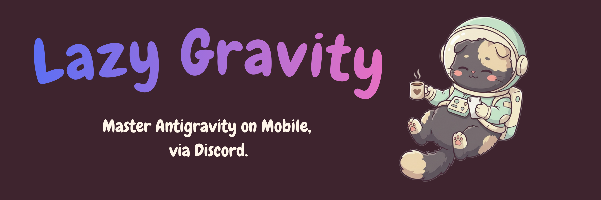

<p align="center">
  
</p>

<p align="center">
  
  
  
  
  
</p>

# 🐾 LazyGravity

**LazyGravity** は、どこからでもスマホのDiscordアプリを使って、自宅PCで稼働する AI コーディング起動ツール (Antigravity 等) を遠隔操作・対話できるローカル完結型のセキュアなDiscord Botです。

外出先からの「あの件、直しておいて」「新しい機能の設計を始めて」といった自然言語の依頼を、自宅PCのマシンパワーとローカル環境で直接・安全に実行し、結果をDiscordで受け取ることができます。

## ✨ 主な機能

1. 🔒 **完全ローカル・セキュア設計**
   - 外部サーバーへのデプロイやWebHook(ポート開放/SSH)は**一切不要**。あなたのPC内でプロセスとして常駐し、Discordと直接通信します。
   - **ホワイトリスト制御**: 許可されたDiscordユーザーID (`allowedUserIds`) 以外からのアクセスは完全に遮断されます。
   - **安全な鍵管理**: Bot TokenやAPIキーはセキュアにPC内ローカル保管され（`.env`のパーミッション厳格化等）、ソースコード上には一切記述されません。
   - **パストラバーサル防止 & リソース保護**: プロジェクト外のディレクトリへの不正アクセスを防ぐJail(サンドボックス)的制御に加え、タスクの同時実行数を制限しPCのフリーズ（DoS）を防ぎます。

2. 📂 **プロジェクト管理 (チャンネル↔ディレクトリ バインディング)**
   - `/project` コマンドでDiscordチャンネルとローカルPCのプロジェクトディレクトリを紐付け。セレクトメニューやボタンによるインタラクティブなUIで直感的に操作できます。
   - バインドされたチャンネルからのメッセージは、自動的にプロジェクトのコンテキスト付きでAntigravityに送信されます。

3. 💬 **コンテキストを引き継ぐEmbed返信**
   - 実行結果はリッチなEmbed形式で通知。その結果に対してDiscordの「返信（Reply）」機能を使って指示を出すことで、Botが過去の文脈や対象ディレクトリを正確に引き継いで後続処理を行います。

4. 📊 **長時間ジョブのリアルタイム監視**
   - 長時間かかるビルドや生成推論タスクの進行を、工程ごとの新規メッセージ（伝達完了 / 計画 / 分析 / 実行確認 / 実装内容 / 最終サマリー）として履歴で確認できます。

5. ⏰ **Cron対応のスケジュール・定期実行タスク機能（将来実装予定）**
   - `ScheduleService` / `ScheduleRepository` は実装済みですが、Discordコマンド（`/schedule`, `/schedules`）への接続は未実装です。

6. 📎 **添付ファイルとコンテキスト解析**
   - Discordに送信した画像（スクショ等）やテキストファイルを読み取り、Antigravity側にコンテキストとして自動で渡すことができます。

## 🚀 使い方とコマンド一覧

### 🪄 メッセージでの自然言語指示
チャンネル内でBotに向けてメンション(`@LazyGravity`)して自然言語で指示を出すだけです。
> `@LazyGravity src/components 配下をリファクタリングして。昨日のスクショみたいなレイアウトにして` (画像添付)

### 💻 スラッシュコマンド（クイックアクション）

- `⚙️ /model [model_name]`
  - 利用するLLM（例: `gpt-4o`, `claude-3-opus`, `gemini-1.5-pro` など）をワンタップで切り替えます。
- `⚙️ /mode [mode_name]`
  - 実行モード（例: `code`, `architect`, `ask` など）を切り替えます。
- `📝 /template list|use|add|delete`
  - よく使うプロンプト（例: `PR作成`, `エラー調査`）を呼び出して即時実行します。新規登録も可能です。
- `📂 /project`
  - プロジェクト一覧をセレクトメニューで表示し、選択するとカテゴリとセッションチャンネルを自動作成します。
- `📂 /project create <name>`
  - 新しいプロジェクトディレクトリを作成し、カテゴリとセッションチャンネルを自動作成します。
- `🛑 /stop`
  - 実行中の時間のかかるタスクや暴走したAIプロセスを安全に強制終了（Kill）します。
- `⏰ /schedule ...` / `/schedules ...`（将来実装予定）
  - コード上のスケジュールサービスはありますが、現時点でDiscordコマンドからは利用できません。
- `💬 /new`
  - プロジェクトカテゴリ配下に新しいセッションチャンネルを作成し、Antigravityで新規チャットを開始します。
- `💬 /chat`
  - 現在のチャットセッション情報と同プロジェクト内の全セッション一覧を表示します。
- `📸 /screenshot`
  - Antigravityの現在の画面をキャプチャしてDiscordに画像として送信します。
- `🔧 /status`
  - BotのCDP接続状態、現在のモード、接続中のプロジェクトなど全体ステータスを表示します。
- `✅ /autoaccept [on|off|status]`
  - 承認ダイアログを自動で許可するモードを切り替えます。`on` で有効化、`off` で無効化、`status` で現在状態を確認できます。

---

## 🔄 運用とトラブルシューティング (再起動など)

Botの調子が悪い場合や、コードを更新した場合は、以下の手順でプロセスを再起動してください。

1. **プロセスを終了する**
   動かしているターミナルで `Ctrl + C` を押すか、以下のコマンドで現在動いているBotプロセスを強制終了します。
   ```bash
   pkill -f "src/index.ts"
   ```
2. **再度起動する**
   プロジェクトのディレクトリで以下のコマンドを実行します。
   ```bash
   npx ts-node src/index.ts
   # または npm run start
   ```

Antigravity本体を再起動した場合は、Botが自動でCDPの再接続を試みます。メッセージを送信すると自動的にプロジェクトに接続されます。

---

## 🛠️ セットアップ (現行手順)

1. **インストール & 起動**
   ```bash
   git clone https://github.com/yourusername/lazy-gravity.git
   cd lazy-gravity
   npm install
   ```

2. **初期設定 (初回のみ)**
   ```bash
   cp .env.example .env
   ```
   `.env` を編集し、以下を設定してください。
   - `DISCORD_BOT_TOKEN`
   - `CLIENT_ID`
   - `ALLOWED_USER_IDS`
   - `WORKSPACE_BASE_DIR`（任意）

   > `npm run setup` / 対話型セットアップは **公開リリース計画の将来項目** で、現行コードには未実装です。

3. **Antigravityをデバッグモードで起動（CDP接続に必要）**

   LazyGravityはChrome DevTools Protocol (CDP) を使ってAntigravityのUIを直接操作します。
   そのため、**Antigravity（VSCode/Electron系）をリモートデバッグポート付きで起動**する必要があります。

   毎回コマンドを打つのは手間なため、**リポジトリ内に用意されている起動用スクリプトをご利用ください**。
   *(※ スクリプトは空いているポートを 9222~9666 から自動検出して起動します)*

   #### 🍏 macOS の場合
   リポジトリ直下にある **`start_antigravity_mac.command`をダブルクリック**するだけでデバッグモードで起動します。

   - **初回実行時**: パーミッションエラー等で開けない場合、一度だけターミナルで以下のコマンドから実行権限を付与してください。
     ```bash
     chmod +x start_antigravity_mac.command
     ```
   - **アプリ名が違う場合**: テキストエディタでファイルを開き、`"Antigravity"` の部分をご利用のアプリ名（例: `"Visual Studio Code"` や `"Cursor"`など）に変更して保存してください。

   #### 🪟 Windows の場合
   リポジトリ直下にある **`start_antigravity_win.bat`をダブルクリック**するだけでデバッグモードで起動します。

   - **起動しない場合**: PATHが通っていない可能性があります。ファイルを右クリックして編集し、`"Antigravity.exe"` をインストール先のフルパス（例: `"%LOCALAPPDATA%\Programs\Antigravity\Antigravity.exe"`など）に書き換えてください。

   ---
   > 💡 **一時的に手動（ターミナル／コマンド）で起動したい場合**
   > ```bash
   > # macOS / Linux
   > open -a "Antigravity" --args --remote-debugging-port=9222
   > 
   > # Windows
   > Antigravity.exe --remote-debugging-port=9222
   > ```

   `.env` の設定例:
   ```env
   # .env
   DISCORD_BOT_TOKEN=your_token_here
   CLIENT_ID=your_application_id_here
   ALLOWED_USER_IDS=123456789,987654321
   WORKSPACE_BASE_DIR=~/Code  # ワークスペースのベースディレクトリ（デフォルト: ~/Code）
   ```

   > **💡 ヒント**: CDPポートは固定候補（9222, 9223, 9333, 9444, 9555, 9666）を自動スキャンします。
   > Antigravityを起動後にBotを起動すれば自動で接続されます。

4. **実行**
   ```bash
   npm run start
   ```
   これでBotがオンラインになります！Discordから話しかけてみてください。

---

## 🔗 CDP接続の仕組み

LazyGravityは以下のようにAntigravityのUIへ接続します:

<p align="center">
  
</p>

1. Botがデバッグポート（デフォルト: 9222）をスキャンし、Antigravityのターゲットを自動検出
2. WebSocket経由でCDPに接続（`Runtime.evaluate` でDOM操作）
3. チャット入力欄へのメッセージ注入、AIレスポンスの監視、スクリーンショット取得などを実行

**接続が切れた場合**: 最大3回まで自動再接続を試みます（`maxReconnectAttempts`で設定可）。
接続に失敗し続けた場合は、Discordにエラーメッセージ（⚠️）が送信されます。
